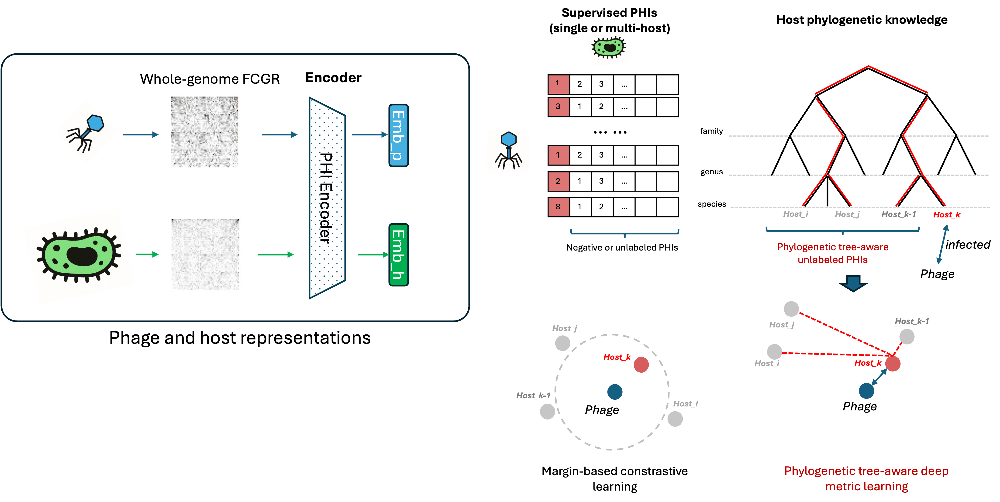

# CE4PHI: Phylogenetic tree-aware positive-unlabeled deep metric learning for phage–host interaction identification

CE4PHI extends [CL4PHI](https://github.com/yaozhong/CL4PHI) from margin-based contrastive learning to a cross-entropy–based deep metric learning framework with explicit phylogenetic tree awareness for phage–host interaction (PHI) identification.

Unlike traditional approaches that treat all non-positive samples as uniform negatives, CE4PHI employs a **TreePUInfoNCE** loss that weights unlabeled hosts by their evolutionary distance to known positive hosts. This encourages the learned embedding space to reflect both infection patterns and host phylogenetic relationships.



---

## Environment and Dependencies

- Python 3.10.12
- PyTorch 2.6.0+cu124
- pyfaidx
- pandas
- scikit-learn
- numpy

Install dependencies:

```bash
pip install torch torchvision --index-url https://download.pytorch.org/whl/cu124
pip install pyfaidx pandas scikit-learn numpy
```

---

## Repository Structure

```
ce4phi_multiHost_tpu-joint/
├── train_cl.py          # Training script (CE4PHI / CL4PHI)
├── eval_tpu.py          # Prediction / inference script
├── cmp_pred_gold.py     # Evaluation: species- and genus-level accuracy
├── eval_tpu_viz.py      # Prediction with t-SNE visualization
├── model.py             # Encoder architectures and TreePUInfoNCE loss
├── data_loading.py      # Data loading and FCGR collation utilities
├── fasta2CGR.py         # K-mer counting and FCGR (Frequency Chaos Game Representation)
└── lorentz.py           # Hyperbolic geometry utilities
```

---

## Input Data Formats

CE4PHI requires five input files. Below are format specifications with examples.

### 1. Host genome FASTA (`--host_fa`)

A multi-FASTA file containing one representative genome per host species.
The sequence header must use underscores in place of spaces for the species name.

```
>Escherichia_coli
ATGCTTAAGCTTGATCGATCGATCGATCG...
>Salmonella_enterica
GCTAGCTAGCTAGCTAGCTAGCTAGCTAG...
```

### 2. Host species list (`--host_list`)

A tab-separated file listing all candidate host species.
Each line: `<genome_identifier>\t<species name with spaces>`.
The species name must exactly match the FASTA header (after replacing `_` with spaces).

```
Escherichia_coli	Escherichia coli
Salmonella_enterica	Salmonella enterica
Klebsiella_pneumoniae	Klebsiella pneumoniae
```

### 3. Phage sequence FASTA (`--train_phage_fa`, `--valid_phage_fa`, `--test_phage_fa`)

A standard multi-FASTA file of phage genome sequences.

```
>phage_001
ATGCTTAAGCTTGATCGATCGATCGATCGATCGATCG...
>phage_002
GCTAGCTAGCTAGCTAGCTAGCTAGCTAGCTAGCTAG...
```

### 4. Host gold standard labels (`--train_host_gold`, `--valid_host_gold`, `--test_host_gold`)

A CSV file with **one line per phage**, in the same order as the phage FASTA.
Each line lists the species name(s) of host(s) that the phage infects (comma-separated for multi-host phages).
An empty line means no known host.

```
Escherichia coli
Salmonella enterica,Klebsiella pneumoniae
Pseudomonas aeruginosa

Escherichia coli
```

### 5. Host phylogenetic distance matrix (`--tree_dist`)

A square CSV matrix of pairwise phylogenetic distances between host species.
Row/column labels must match the species names in the host list (underscores or spaces).

```csv
,Escherichia_coli,Salmonella_enterica,Klebsiella_pneumoniae
Escherichia_coli,0.0,0.12,0.35
Salmonella_enterica,0.12,0.0,0.28
Klebsiella_pneumoniae,0.35,0.28,0.0
```

This matrix is typically computed from a GTDB-Tk phylogenetic tree using `FastTree` and a tree-distance extraction script. See the GTDB-Tk documentation for constructing host trees.

### 6. GTDB taxonomy file (`--taxo_dic`)

The standard GTDB taxonomy TSV file (`gtdb_taxonomy.tsv`) from a GTDB release.
Used for optional taxonomy-level tree masking. Download from the [GTDB releases page](https://gtdb.ecogenomic.org/downloads).

---

## Usage

### Step 1 — Train CE4PHI

The recommended configuration uses a shared CNN encoder (`--enc_mode share`) and the TreePUInfoNCE loss (`--lossType tpuNCE`).

```bash
python train_cl.py \
    --model CNN \
    --model_dir saved_models/my_experiment.pth \
    --finetune_model_dir none \
    --enc_mode share \
    --kmer 6 \
    --host_fa data/host_genomes.fasta \
    --host_list data/host_species.txt \
    --train_phage_fa data/phage_train.fasta \
    --train_host_gold data/phage_train_y.csv \
    --valid_phage_fa data/phage_val.fasta \
    --valid_host_gold data/phage_val_y.csv \
    --device cuda:0 \
    --lr 1e-5 \
    --epoch 300 \
    --batch_size 32 \
    --lossType tpuNCE \
    --temperature 0.07 \
    --tree_dist data/host_phylo_dist.csv \
    --tree_sigma -1 \
    --tree_ce_eps 0.02 \
    --tree_level none \
    --lambda_ph_tree 0 \
    --metric chord \
    --taxo_dic data/gtdb_taxonomy.tsv \
    --seed 123 \
    | tee logs/my_experiment.txt
```

**Training output:** The script saves the best model checkpoint (by validation accuracy) to `--model_dir`.
At the end of training a summary line is printed:

```
[Valid epoch idx/epoch]:195/300, [valid acc]:0.7634
 @ used training time: 114.00 s. Total time: 301.84
```

#### Key training parameters

| Parameter | Default | Description |
|-----------|---------|-------------|
| `--kmer` | — | K-mer size for FCGR feature extraction (recommended: `6`) |
| `--enc_mode` | `share` | `share`: single shared encoder for phage and host; `seperate`: two independent encoders |
| `--lossType` | `tpuNCE` | `tpuNCE`: tree-aware cross-entropy loss; `margin_cl`: margin-based contrastive loss |
| `--temperature` | `0.07` | InfoNCE temperature; lower values sharpen the distribution |
| `--tree_ce_eps` | `0.02` | Mass allocated to phylogeny-weighted negatives (ε ≈ 0.02–0.05 works well) |
| `--tree_sigma` | `-1` | Kernel bandwidth for phylogenetic weighting; `-1` for automatic median-based scaling |
| `--tree_level` | `none` | Optional taxonomic mask for negatives: `none` / `genus` / `all` |
| `--metric` | `chord` | Embedding distance: `chord` / `euclidean` / `cosine` / `hyperbolic` |
| `--lr` | `1e-5` | Adam learning rate |
| `--epoch` | `300` | Maximum training epochs (early stopping by validation accuracy) |
| `--batch_size` | `32` | Training batch size |
| `--seed` | `123` | Random seed for reproducibility |

---

### Step 2 — Predict host(s) for test phages

```bash
python eval_tpu.py \
    --model CNN \
    --model_dir saved_models/my_experiment.pth \
    --enc_mode share \
    --kmer 6 \
    --host_fa data/host_genomes.fasta \
    --host_list data/host_species.txt \
    --test_phage_fa data/phage_test.fasta \
    --test_host_gold data/phage_test_y.csv \
    --device cuda:0 \
    --metric chord \
    > results/my_experiment_pred.txt
```

`--test_host_gold` is optional. Omit it to run prediction-only mode (no evaluation during inference).

**Prediction output format** (tab-separated, one phage per line):

```
phage_001	Escherichia coli_0.0312	Salmonella enterica_0.1458	Klebsiella pneumoniae_0.2871	...
phage_002	Pseudomonas aeruginosa_0.0521	Escherichia coli_0.1832	...
```

Each field after the phage ID is `<species name>_<distance score>`, sorted from closest (lowest distance = highest confidence) to furthest.

---

### Step 3 — Evaluate predictions

```bash
python cmp_pred_gold.py \
    --pred results/my_experiment_pred.txt \
    --gold data/phage_test_y.csv
```

**Evaluation output:**

```
========== MULTI-HOST AWARE EVALUATION (label-wise, top-G) ==========
Species-level accuracy = 0.6025
Genus-level accuracy   = 0.7066
---------------------------------------------------
Total gold species labels: 634
Total hits (species):      382
Total gold genera labels:  634
Total hits (genera):       448
===================================================

========== K-BEST EVALUATION (instance-wise) ==========
Species-level (total phages with gold): 634
  Top- 1 species-accuracy: 0.6025  (correct=382)
  Top- 3 species-accuracy: 0.7413  (correct=470)
  Top- 5 species-accuracy: 0.7965  (correct=505)
  Top-10 species-accuracy: 0.8801  (correct=558)
---------------------------------------------------
Genus-level (total phages with gold):   634
  Top- 1 genus-accuracy:   0.7066  (correct=448)
  Top- 3 genus-accuracy:   0.8391  (correct=532)
  Top- 5 genus-accuracy:   0.8896  (correct=564)
  Top-10 genus-accuracy:   0.9227  (correct=585)
===================================================
```

**Metric definitions:**
- **Multi-host top-G accuracy**: for each phage, the top-G predictions (where G = number of known hosts) are checked; the fraction of known hosts recovered is accumulated across all phages.
- **Top-K accuracy**: a phage is counted as correctly predicted at rank K if at least one of its known hosts appears in the top-K predictions.

---

## Complete Example: CHERRY Dataset

This reproduces the CHERRY benchmark results reported in the paper.

```bash
# Paths (adjust to your directory layout)
HOMEDIR="/path/to/your/data"
CODE_DIR="/path/to/ce4phi_multiHost_tpu-joint"

# ── Training ───────────────────────────────────────────────────────────────
python ${CODE_DIR}/train_cl.py \
    --model CNN \
    --model_dir saved_models/cherry_ce4phi.pth \
    --finetune_model_dir none \
    --enc_mode share \
    --kmer 6 \
    --host_fa ${HOMEDIR}/cherry/host_genomes.fasta \
    --host_list ${HOMEDIR}/cherry/host_species.txt \
    --train_phage_fa ${HOMEDIR}/cherry/phage_all.fasta \
    --train_host_gold ${HOMEDIR}/cherry/phage_all_y.csv \
    --valid_phage_fa ${HOMEDIR}/cherry/phage_all.fasta \
    --valid_host_gold ${HOMEDIR}/cherry/phage_all_y.csv \
    --device cuda:0 \
    --lr 1e-5 \
    --epoch 300 \
    --batch_size 32 \
    --lossType tpuNCE \
    --temperature 0.07 \
    --tree_dist ${HOMEDIR}/cherry/host_phylo_dist.csv \
    --tree_sigma -1 \
    --tree_ce_eps 0.02 \
    --tree_level none \
    --lambda_ph_tree 0 \
    --metric chord \
    --taxo_dic ${HOMEDIR}/databases/gtdb_taxonomy.tsv \
    --seed 123 \
    | tee logs/cherry_training.txt

# ── Prediction ─────────────────────────────────────────────────────────────
python ${CODE_DIR}/eval_tpu.py \
    --model CNN \
    --model_dir saved_models/cherry_ce4phi.pth \
    --enc_mode share \
    --kmer 6 \
    --host_fa ${HOMEDIR}/cherry/host_genomes.fasta \
    --host_list ${HOMEDIR}/cherry/host_species.txt \
    --test_phage_fa ${HOMEDIR}/cherry/phage_test.fasta \
    --test_host_gold ${HOMEDIR}/cherry/phage_test_y.csv \
    --device cuda:0 \
    --metric chord \
    > results/cherry_predictions.txt

# ── Evaluation ─────────────────────────────────────────────────────────────
python ${CODE_DIR}/cmp_pred_gold.py \
    --pred results/cherry_predictions.txt \
    --gold ${HOMEDIR}/cherry/phage_test_y.csv
```

Expected validation accuracy during training: ~0.76 at epoch 195/300.

---

## Prediction-Only Mode (no gold labels)

If you only have phage sequences and want predictions without evaluation:

```bash
python eval_tpu.py \
    --model CNN \
    --model_dir saved_models/my_experiment.pth \
    --enc_mode share \
    --kmer 6 \
    --host_fa data/host_genomes.fasta \
    --host_list data/host_species.txt \
    --test_phage_fa data/new_phages.fasta \
    --device cuda:0 \
    --metric chord \
    > results/new_phage_predictions.txt
```

The output lists all host candidates ranked by embedding distance (ascending) for each query phage.

---

## Benchmark Results

### CHERRY dataset (406 phages, 52 hosts, species-level split)

| Method | Top-1 Species | Top-1 Genus | Top-3 Species | Top-5 Species |
|--------|--------------|-------------|--------------|--------------|
| CE4PHI (this work) | **0.603** | **0.707** | **0.741** | **0.797** |
| CL4PHI | 0.582 | 0.689 | 0.720 | 0.775 |

### Hi-C metagenomic dataset (split 1)

| Method | Top-1 Species | Top-1 Genus | Top-3 Genus |
|--------|--------------|-------------|-------------|
| CE4PHI | 0.630 | **0.957** | **1.000** |

---

## Citation

If you use CE4PHI in your research, please cite:

```bibtex
@article{ce4phi2025,
  title   = {Phylogenetic tree-aware positive-unlabeled deep metric learning for phage--host interaction identification},
  author  = {Zhang, Yaozhong and colleagues},
  year    = {2025}
}
```

---

## Related Work

- **CL4PHI** (predecessor): [https://github.com/yaozhong/CL4PHI](https://github.com/yaozhong/CL4PHI)
- **GTDB-Tk** for host phylogenetic tree construction: [https://github.com/Ecogenomics/GTDBTk](https://github.com/Ecogenomics/GTDBTk)
- **FastTree** for tree distance extraction
